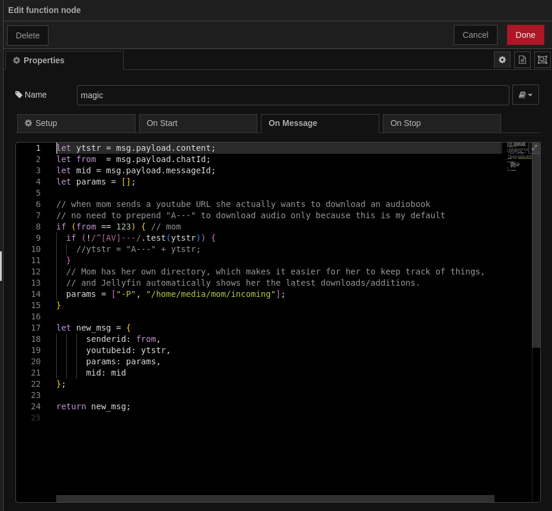

## YTDLTT – MQTT-Controlled YouTube Downloader

ytdltt listens to the `yt/dl` MQTT topic and downloads YouTube videos
or audio sequentially using `yt-dlp`.

The intended usecase is that this apps runs as systemd service. It
watches a mqtt topic for a JSON string of paramters, downloads the
content and uses (optionally) `telegram/message` mqtt topic to reply a
wormhole code to the sender who will be able to use that code to
download directly.

### Features

- Audio or video download via URL prefix:
  - `A---https://...`
  - `V---https://...` → video (MP4)
- Optional: [Magic Wormhole](https://magic-wormhole.readthedocs.io/) one-time download code via telegram

### Workflow

It should work well with node-red and telegram:

* node-red watches telegram bot for incoming message (a youtuble url,
  maybe prefixed)
* check in node if sender is authorized
* optionally we may apply params, depending on senderID
* submits hash to `yt/dl` topic
* which is processed by `ytdltt`
* `ytdltt` sends wormhole code if applicable via `message/telegram` (which is further handled by node red)

#### Example node-red function node




### Requirements

- `yt-dlp` and `ffmpeg` in `$PATH`
- MQTT broker
- Ruby with [`Trompie`](https://github.com/entropie/trompie) which enables seamless communication with mqtt broker
- Optional: `magic-wormhole`

### Example MQTT Payload

* `url`: mandatory; prefix says if audio (A---) only or complete video (V---), prefix defaults to `config[:variant]`
* `senderid`: optional; could be used (is not) except for telegram reply
* `mid`: optional; telegrams conversation id, 
* `paramters`: optional; expand yt-dlp argument list, also add different output path ( `["-P", "/tmp/foo"]` )

```json
{
  "url": "A---https://youtu.be/xyz123",
  "senderid": 4936578,
  "mid": 2834,
  "parameters": ["-P", "/home/media/mom/incoming"]
}
```

### Nix systemd service definition, should be easy to adapt

    systemd.services.ytdltt = {
      description = "Run ytdltt Ruby script";
      after = [ "network.target" ];
      wantedBy = [ "multi-user.target" ];
  
      serviceConfig = {
        Type = "simple";
        User = "mit";
        ExecStart = "${pkgs.ruby_3_2}/bin/ruby /etc/nixos/res/gems/ytdltt/bin/ytdltt";
        WorkingDirectory = "/etc/nixos/res/gems/ytdltt";
  
        Environment = [
          "PATH=${lib.makeBinPath [
            pkgs.ruby_3_2
            pkgs.ffmpeg
            pkgs.yt-dlp
          ]}:/etc/profiles/ruby-gems/bin"
        ];
  
        Restart = "on-failure";
        RestartSec = "60s";
        StartLimitBurst = 5;
      };
    };


